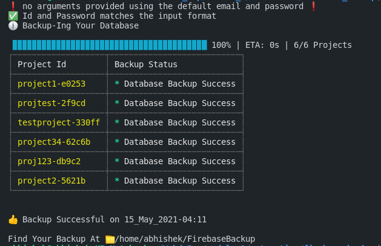
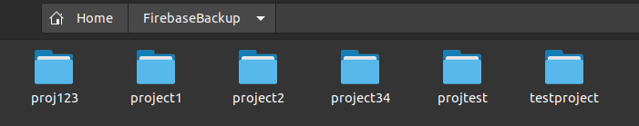
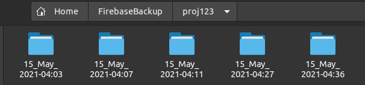
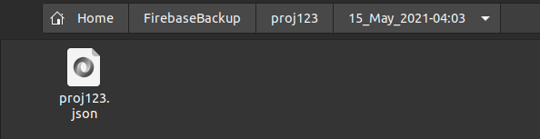

<p align="center">
  <a href="" rel="noopener">
 </a>
</p>
<h3 align="center">Firebase Realtime Database Backup Taker</h3>

<div align="center">

[](https://www.pepcoding.com/)
[]()
[](https://github.com/mishra5047/FirebaseBackup)
[](LICENSE.md)

</div>

---

<p align="center"> .
    <br> 
</p>

## 📝 Table of Contents

- [Problem Statement](#problem_statement)
- [Idea / Solution](#idea)
- [Dependencies / Limitations](#limitations)
- [Future Scope](#future_scope)
- [Setting up a local environment](#getting_started)
- [Usage](#usage)
- [Technology Stack](#tech_stack)
- [Contributing](../CONTRIBUTING.md)
- [Authors](#authors)
- [Acknowledgments](#acknowledgments)

## 🧐 Problem Statement <a name = "problem_statement"></a>

For a firebase user that uses the free plan for any project. The user has no option to automatically take backup of the realtime database at a specific interval.

- IDEAL: I came up with the solution to run this script in order to take the backup of all the projects existing in the user's firebase console.
- Note: This is not a way to avoid the paid plan of firebase, it's just an alternative to help students to backup their project's important data.

## 💡 Idea / Solution <a name = "idea"></a>

This section is used to describe potential solutions.

Once the ideal, reality, and consequences sections have been
completed, and understood, it becomes easier to provide a solution for solving the problem.

## ⛓️ Dependencies / Limitations <a name = "limitations"></a>

- The user must have an valid google account in order to login to firebase.
- There should be at least one project existing in his / her Firebase Console.
- In case the user has a project that doesn't have a realtime database in this case the script will just notify the user after the completion.

## 🚀 Future Scope <a name = "future_scope"></a>

Right now this script is only capable of taking backup of firebase realtime database. It can be expanded to other services as well.

The local folder of backup can be uploaded to google drive of the user using Google Drive API. 

## 🏁 Getting Started <a name = "getting_started"></a>

### Prerequisites

The only prerequisite is installing NodeJs in your system.

### Installing

Install NodeJs from 
```
https://nodejs.org/en/
```

After installing

```
node script.js
```

## 🎈 Usage <a name="usage"></a>

Just run the script in a system that has NodeJs environment installed

## ⛏️ Built With <a name = "tech_stack"></a>

- [Firebase](https://console.firebase.google.com/) - Database - Web Framework
- [NodeJs](https://nodejs.org/en/) - Server Environment

## ✍️ Authors <a name = "authors"></a>

- [@AbhishekMishra](https://github.com/mishra5047) - Idea & All the work

## 🎉 Acknowledgments <a name = "acknowledgments"></a>

- https://pptr.dev documentation
- https://www.npmjs.com/ Plugins
- References

## 🏁 Screenshots - 
<br>
<br>
<br>
<br>