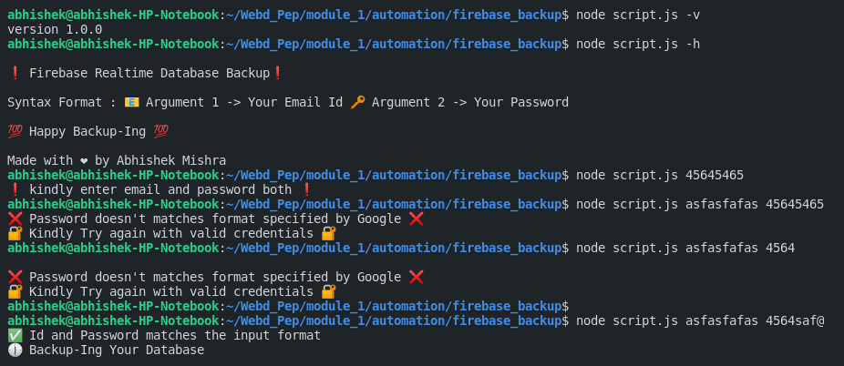
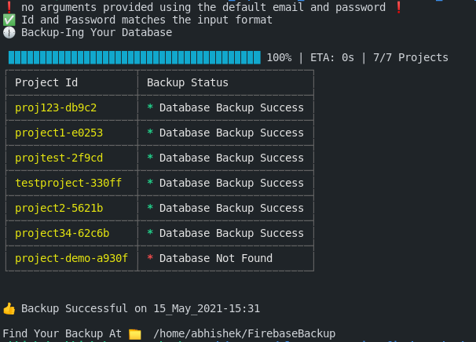

<p align="center">
  <a href="" rel="noopener">
 </a>
</p>
<h3 align="center">Firebase Realtime Database Backup Taker</h3>

<div align="center">


[](https://github.com/mishra5047/FirebaseBackup)

[](LICENSE.md)

</div>

---

<p align="center"> .
    <br> 
</p>

## 📝 Table of Contents

- [Problem Statement](#problem_statement)
- [Dependencies / Limitations](#limitations)
- [Project Structure](#structure)
- [Future Scope](#future_scope)
- [Setting up a local environment](#getting_started)
- [Usage](#usage)
- [Technology Stack](#tech_stack)
- [Authors](#authors)
- [ScreenShots](#screenshots)

## 🧐 Problem Statement <a name = "problem_statement"></a>

For a firebase user that uses the free plan for any project. The user has no option to automatically take backup of the realtime database at a specific interval.

- IDEAL: I came up with the solution to run this script in order to take the backup of all the projects existing in the user's firebase console.
- *Note*: This is not a way to avoid the paid plan of firebase, it's just an alternative to help students to backup their project's important data.

## ⛓️ Dependencies / Limitations <a name = "limitations"></a>

- The user must have an valid google account in order to login to firebase.
- There should be at least one project existing in his / her Firebase Console.
- In case the user has a project that doesn't have a realtime database in this case the script will just notify the user after the completion.

## Package Dependencies -
- Cli-progress [https://www.npmjs.com/package/cli-progress]
- Node-Emoji [https://www.npmjs.com/package/node-emoji]
- OS [https://www.npmjs.com/package/os]
- FS [https://www.npmjs.com/package/fs]
- Puppeteer [https://www.npmjs.com/package/puppeteer]
- Cli Table [https://www.npmjs.com/package/cli-table]
- Colors [https://www.npmjs.com/package/colors]

## 📁 Project Structure <a name="structure"></a>

- 💻 script.js -> The main script
- 📁 Util -> Contains the utility scrips like validation and display functions.
- 📁 Screenshots -> Contains the screenshots of the script, that are used in the readme
## 🚀 Future Scope <a name = "future_scope"></a>

Right now this script is only capable of taking backup of firebase realtime database. It can be expanded to other services as well.

The local folder of backup can be uploaded to google drive of the user using Google Drive API. 

## 🏁 Getting Started <a name = "getting_started"></a>

### Prerequisites

The only prerequisite is installing NodeJs in your system.

### Installing

Install NodeJs from 
```
https://nodejs.org/en/
```

After installing

if you want to run using the default email and password
```
node script.js
```
### *Note* - To change your default email and password, head over to function *"showDefault() in script.js"*. Enter your emailId and Password.

Enter your email and password in format
```
node script.js [email-here] [password-here]
```


## 🎈 Usage <a name="usage"></a>

Just run the script in a system that has NodeJs environment installed.

And your backup will be stored under -

```
[Your_Home_Directory]/FirebaseBackup
```
## ⛏️ Built With <a name = "tech_stack"></a>

- [Firebase](https://console.firebase.google.com/) - Database
- [NodeJs](https://nodejs.org/en/) - Server Environment

## ✍️ Authors <a name = "authors"></a>

- [@AbhishekMishra](https://github.com/mishra5047)

## 🏁 Screenshots <a name="screenshots"></a> 

<br>

<br>

</br>

<br>

<br>

<br>

